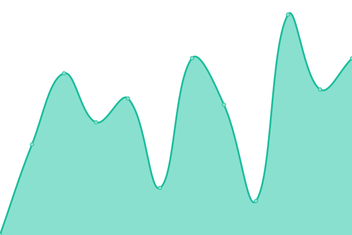

# [📈 Live Status](https://demo.upptime.js.org): <!--live status--> **🟧 Partial outage**

This repository contains the open-source uptime monitor and status page for [Jon Hadfield](https://demo.upptime.js.org), powered by [Upptime](https://github.com/upptime/upptime).

With [Upptime](https://upptime.js.org), you can get your own unlimited and free uptime monitor and status page, powered entirely by a GitHub repository. We use [Issues](https://github.com/jonhadfield/monitor/issues) as incident reports, [Actions](https://github.com/jonhadfield/monitor/actions) as uptime monitors, and [Pages](https://demo.upptime.js.org) for the status page.

<!--start: status pages-->
<!-- This summary is generated by Upptime (https://github.com/upptime/upptime) -->
<!-- Do not edit this manually, your changes will be overwritten -->
<!-- prettier-ignore -->
| URL | Status | History | Response Time | Uptime |
| --- | ------ | ------- | ------------- | ------ |
|  [O2 Portal](https://www.o2.com) | 🟥 Down | [o2-portal.yml](https://github.com/jonhadfield/monitor/commits/master/history/o2-portal.yml) | 

 0ms
     
 | 

<a href="https://jonhadfield.github.io/monitor/history/o2-portal">0.00%</a>
    

|  [O2 Shop](https://www.o2.co.uk/shop/brand/apple) | 🟩 Up | [o2-shop.yml](https://github.com/jonhadfield/monitor/commits/master/history/o2-shop.yml) | 

 1089ms
     
 | 

<a href="https://jonhadfield.github.io/monitor/history/o2-shop">94.81%</a>
    

|  [O2 Accounts](https://accounts.o2.co.uk/signin) | 🟩 Up | [o2-accounts.yml](https://github.com/jonhadfield/monitor/commits/master/history/o2-accounts.yml) | 

 492ms
     
 | 

<a href="https://jonhadfield.github.io/monitor/history/o2-accounts">100.00%</a>
    

|  [Broken Site](https://thissitedoesnotexist.com) | 🟥 Down | [broken-site.yml](https://github.com/jonhadfield/monitor/commits/master/history/broken-site.yml) | 

 0ms
     
 | 

<a href="https://jonhadfield.github.io/monitor/history/broken-site">100.00%</a>
    

|  Secret Site | 🟥 Down | [secret-site.yml](https://github.com/jonhadfield/monitor/commits/master/history/secret-site.yml) | 

 0ms
     
 | 

<a href="https://jonhadfield.github.io/monitor/history/secret-site">0.00%</a>
    

<!--end: status pages-->

[**Visit our status website →**](https://demo.upptime.js.org)

## 📄 License

- Code: [MIT](./LICENSE) © [Jon Hadfield](https://demo.upptime.js.org)
- Data in the `./history` directory: [Open Database License](https://opendatacommons.org/licenses/odbl/1-0/)
