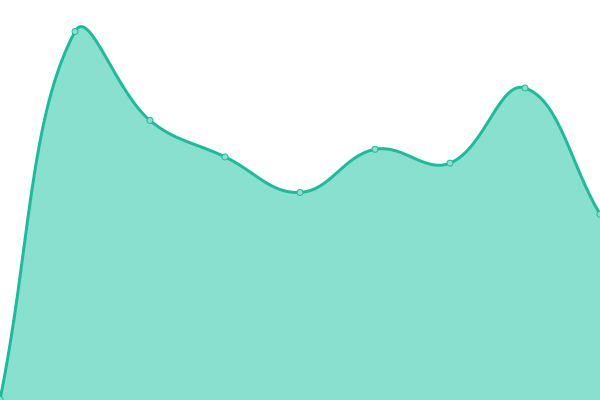

# [📈 Live Status](https://demo.upptime.js.org): <!--live status--> **🟧 Partial outage**

This repository contains the open-source uptime monitor and status page for [Jon Hadfield](https://demo.upptime.js.org), powered by [Upptime](https://github.com/upptime/upptime).

With [Upptime](https://upptime.js.org), you can get your own unlimited and free uptime monitor and status page, powered entirely by a GitHub repository. We use [Issues](https://github.com/jonhadfield/monitor/issues) as incident reports, [Actions](https://github.com/jonhadfield/monitor/actions) as uptime monitors, and [Pages](https://demo.upptime.js.org) for the status page.

<!--start: status pages-->
<!-- This summary is generated by Upptime (https://github.com/upptime/upptime) -->
<!-- Do not edit this manually, your changes will be overwritten -->

| URL                                              | Status  | History                                                                                          | Response Time                                                                    | Uptime                                                                                                                                                                                                                         |
| ------------------------------------------------ | ------- | ------------------------------------------------------------------------------------------------ | -------------------------------------------------------------------------------- | ------------------------------------------------------------------------------------------------------------------------------------------------------------------------------------------------------------------------------ |
| [O2 Portal](https://www.o2.com)                  | 🟥 Down | [o2-portal.yml](https://github.com/jonhadfield/monitor/commits/master/history/o2-portal.yml)     |  0ms     |        |
| [O2 Shop](https://www.o2.co.uk/shop/brand/apple) | 🟥 Down | [o2-shop.yml](https://github.com/jonhadfield/monitor/commits/master/history/o2-shop.yml)         |  1177ms    |          |
| [O2 Accounts](https://accounts.o2.co.uk/signin)  | 🟩 Up   | [o2-accounts.yml](https://github.com/jonhadfield/monitor/commits/master/history/o2-accounts.yml) |  594ms |  |
| [Broken Site](https://thissitedoesnotexist.com)  | 🟥 Down | [broken-site.yml](https://github.com/jonhadfield/monitor/commits/master/history/broken-site.yml) |  0ms   |  |
| Secret Site                                      | 🟥 Down | [secret-site.yml](https://github.com/jonhadfield/monitor/commits/master/history/secret-site.yml) |  0ms   |   |

<!--end: status pages-->

[**Visit our status website →**](https://demo.upptime.js.org)

## 📄 License

- Code: [MIT](./LICENSE) © [Jon Hadfield](https://demo.upptime.js.org)
- Data in the `./history` directory: [Open Database License](https://opendatacommons.org/licenses/odbl/1-0/)
